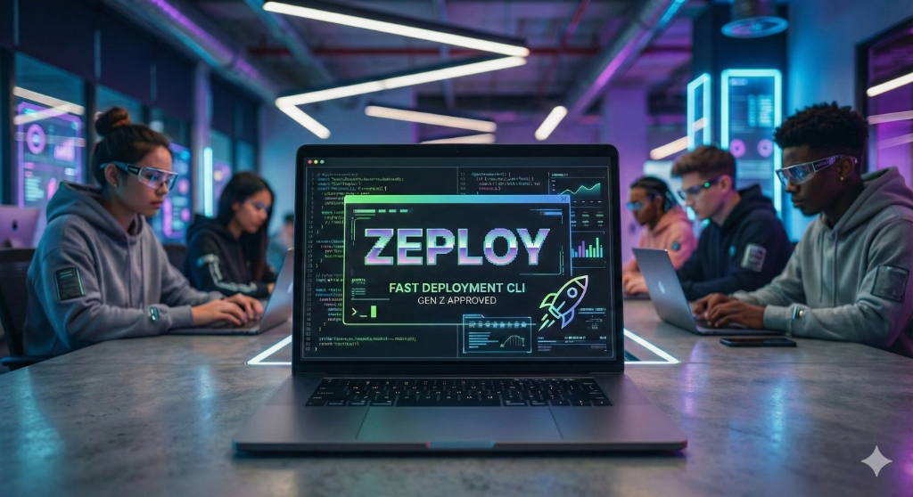

# Next-Gen DevOps Portfolio

Welcome to the source code for my interactive DevOps & Cloud Engineering portfolio! 

This repository houses a highly immersive, interactive website designed to showcase modern cloud architectures, infrastructure-as-code expertise, and real-time terminal-based engineering games.

 <!-- Update with an actual great screenshot of your site -->

## ✨ Features
- **Cyberpunk / Server Aesthetics:** Built with a dark, high-contrast UI, complete with Matrix rain and a glowing server rack background utilizing Framer Motion.
- **Interactive Terminals:** Real, simulated CLI challenges right in the browser. Users can play through 60 advanced scenarios covering:
  - 🐳 **Docker:** Multi-stage builds, Cgroups, networking, and volume diagnostics.
  - ☸️ **Kubernetes:** RBAC troubleshooting, CrashLoopBackOff debugging, and NetworkPolicies.
  - 🚨 **Incident Response:** Deep Linux systems debugging, tracing memory leaks, and OOM killer analysis.
- **Fully Responsive Layout:** Designed from the ground up with flexible Tailwind grids and mobile-first compatibility so the terminal challenges remain playable on smaller screens. 

## 🛠️ Tech Stack
- **Framework:** [Next.js 15](https://nextjs.org/) (App Router)
- **Styling:** [Tailwind CSS](https://tailwindcss.com/) & Vanilla CSS custom animations
- **Animation:** [Framer Motion](https://www.framer.com/motion/)
- **Icons:** [Lucide React](https://lucide.dev/)
- **Deployment:** [Vercel](https://vercel.com)

## 🚀 Getting Started

First, install the dependencies (make sure you use the exact versions specified in the package.json, especially for Next.js 15 backports):

```bash
npm install
```

Then, run the development server locally:

```bash
npm run dev
```

Open [http://localhost:3000](http://localhost:3000) with your browser to explore the portfolio. You can start editing the main layout by modifying `src/app/page.tsx`.

## 📂 Project Structure
- `src/app/page.tsx`: The primary portfolio dashboard.
- `src/components/`: Contains all UI elements, including the Navbar, Footer, and animated backgrounds.
- `src/components/games/`: React components for the interactive Docker, K8s, and Incident Response terminal widgets.
- `src/lib/game-data/`: Externalized TypeScript scenarios mapping out all the hints, outputs, and validation keys for the terminal games.

## 🤝 Let's Connect
Feel free to drop a message or reach out via [LinkedIn](https://www.linkedin.com/in/sanskar-goyal-a00a3b221/) if you have any questions or collaboration ideas!
